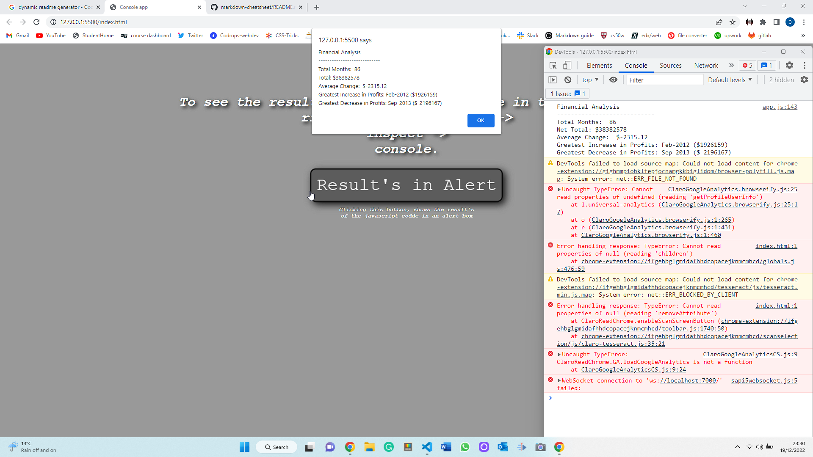

# Console App

[Link To Deployment](https://daniel-boxall.github.io/console-app-javascript/)

---

## Overview

This app was created for Week 4 challenge in my bootcamp, this week we went though Javascript fundamentals varriables, Arrays, for loops, if else statements, prompts, comfirms and alerts. In this challenge we where given a 2 dimentional array and asked to do some calculations using this dataset.

---

## Acceptance Criteria

Your task is to write JavaSript code that analyzes the record to calculate each of the following:

-   The total number of months in the dataet.
-   The net total amount of profit/losses over the entire period.
-   The average of the **changes** in profit/losses over the period.
-   The greatest increase in profits (date and amount) over the entire period.
-   The greatest decrease in losses (date and amount) over the entire period.

When you open your code in the browser your resaulting analysis should look similar to the following:

```
Financial Analysis
--------------------------------
Total Months: 25
Total: $2561231
Average Change: $-2315.12
Greatest Increase in profits: Feb-2012 ($1926159)
Greatest Decrease in Profits: Sep-2013 ($-2196167)

```

---

## Description of completed app

To complete this challenge the JavaScript file uses just:

-   7 Variables
-   2 for loops
-   2 if statements
-   1 alert with eventListener

To tie in the prompts, confirms and alerts section of this weeks tutorials i added a button in index.html and connected an eventListener onClick to push an alert displaying the Financial Analysis statement to the browser.


